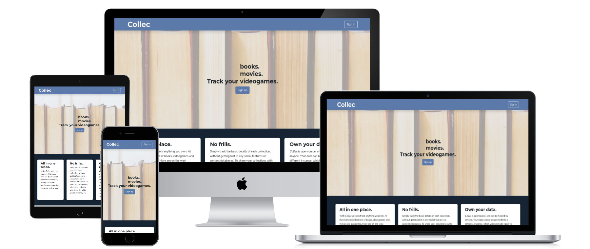
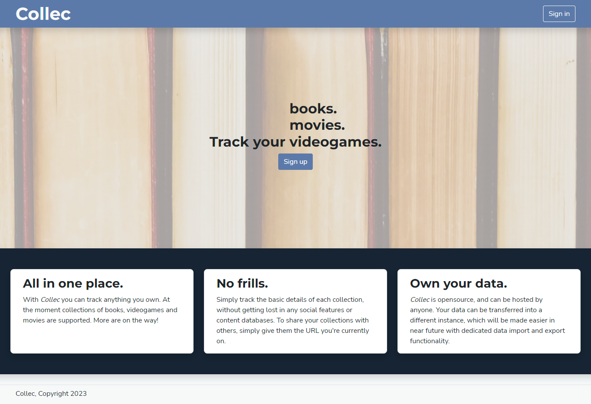
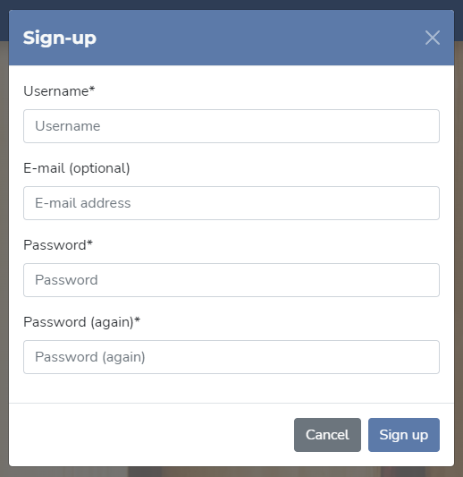
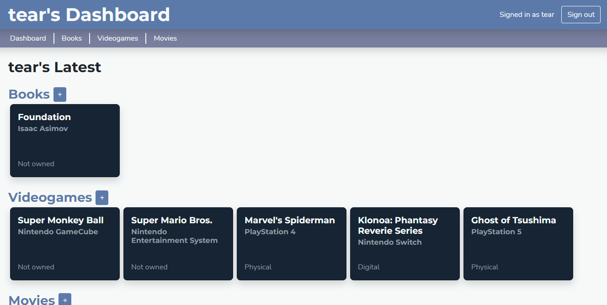
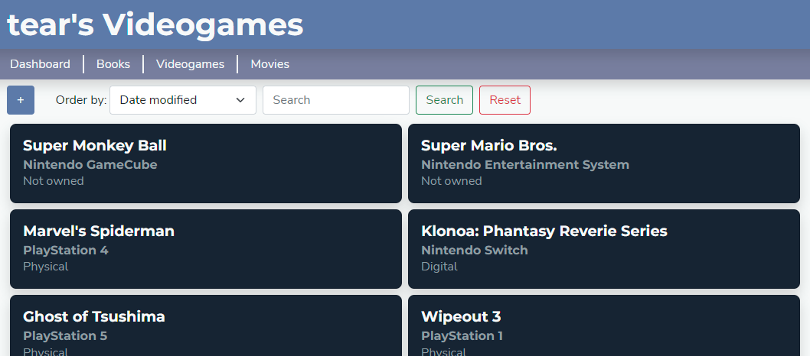
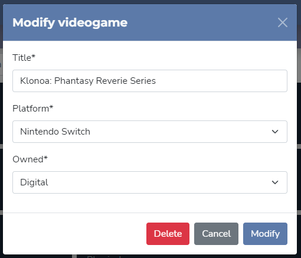
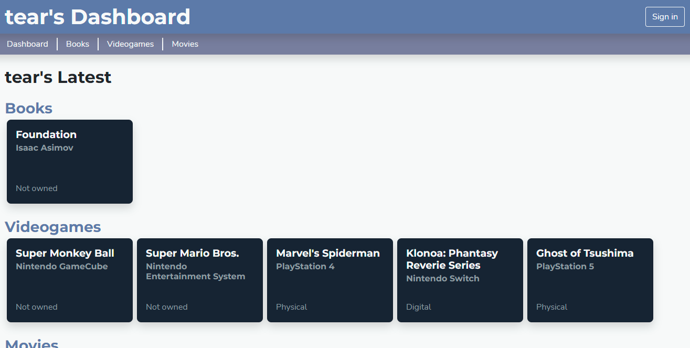
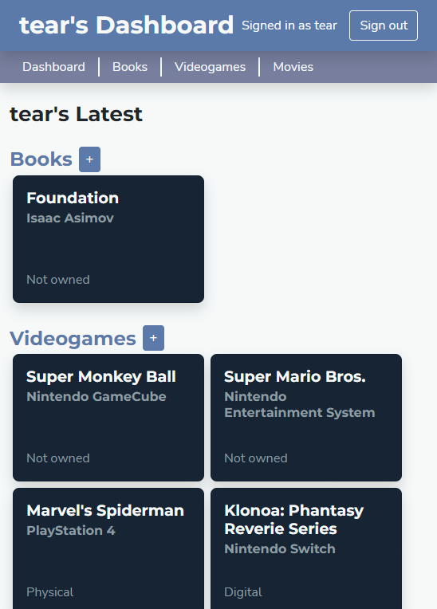

# Collec: a collection tracker webapp



*Collec* is a webapp for tracking several types of collections. It was originally made for [Code Institute](https://codeinstitute.net/)'s 4th submission project.

A live version is deployed and available [here](https://collec.tear.moe).

## Important notes

The documentation is split across two files:

-   [README.md](README.md) (this file): Overview of the app. Read this to get an idea of the premise of the app, technologies used and project conventions.
-   [DESIGN.md](doc/DESIGN.md): UX design notes crafting during early stages of development. The design process is described entirely, from the concept and market research, through information structuring to visual design principles and color palettes.

The project is managed via a [GitHub project](https://github.com/users/Tearnote/projects/1/views/1). Issues are created in a "User story" format, and assigned size/complexity and importance. Each issue contains a title, user story sentence, and a list of technical expectations.

## Highlights



The landing page is simple and to the point, cleanly explaining the purpose of the app.



The sign-in and sign-up screens are modals, with their content loaded from the server via AJAX.



After signing in, the user can open their Dashboard which shows 5 most recently modified items from each collection. Item creation and editing is available from here as a shortcut.



Each collection can be viewed in detail, with sorting and search functionality.



Items can be created, modified and deleted using the editor modal, loaded from the server like the sign-in/up ones.



Opening a user's page without signing in as them enters read-only mode, allowing anyone to browse your collection.



Every page is trivially responsive with wrapping UI elements and grids.

## Technologies used

-   Python 3: Used for the backend portion of the app,
-   HTML5+CSS3: Design of the frontend,
-   Javascript (ES6): Interactive functionality and AJAX calls.

## Dependencies

All dependencies are included, or installed via requirements.txt.

-   [Django 4.1](https://www.djangoproject.com): backend framework used to serve the app to the browser and as a RESTful interface to manipulate the models,
-   [Bootstrap 5](https://getbootstrap.com): CSS framework for grid layout and improved based styles,
-   [django-crispy-forms](https://github.com/django-crispy-forms/django-crispy-forms): Django library that improves form rendering,
-   [django-allauth](https://www.intenct.nl/projects/django-allauth/): Django library that expands on the built-in user authentication.

## Deployment

*Collec* is a Django web-app, and is deployed via the standard Django procedures. A number of settings is exposed via environment variables, some of which must be set for the app to load:

-   `COLLEC_SECRET_KEY`: required. Must be set to any string, as long as it's kept secret. Make sure the key is not present in committed code, logs, etc.
-   `COLLEC_DEBUG`: if set, *Collec* will start in debug mode. Errors will be printed on the site, potentially exposing sensitive information. Use only for debugging and development.
-   `COLLEC_HOST`: required if `COLLEC_DEBUG` is not set. Hostname that will be used to access the site, such as `collec.example.com`. Accesses from any other source will be denied.

### Deployment example

*Collec* can be deployed via a number of methods - to a dedicated server, application platform such as S3 or Heroku, a Docker container, etc. The instance [above](#collec-a-collection-tracker-webapp) was deployed to a virtual environment (venv) in a dedicated server. The procedure will be detailed below for reference.

Prerequisites:

-   Server is running a Linux distribution with systemd,
-   Nginx is installed and running,
-   PostgreSQL is installed and running.

1.  Navigate to the destination folder that will store the application, such as `/srv/http`,
2.  Clone the repository:  
    ```
    git clone https://github.com/Tearnote/collec
    ```
3.  We need to set up a virtual environment for Python. Enter the cloned project, and create a fresh virtualenv:  
    ```
    python -m venv venv
    ```
4.  Activate the virtual environment in current shell. This should add `(venv)` to your visible command line:  
    ```
    source venv/bin/activate
    ```
5.  Dependencies can now be installed with the following command:  
    ```
    pip install -r requirements.txt
    ```
6.  The dependencies include Gunicorn and Psycopg2, which will be required for a production deployment. Gunicorn will need to be configured separately to match your deployment. An example configuration file is included [here](doc/gunicorn.conf.py). Copy this to the root folder of the project, and customize it with your server's paths.
7.  We will now configure the database. *Collec* is by default configured to use a Sqlite database file, which is only suitable for a test deployment with few concurrent users. Configure your Postgres connection in `collec/settings.py`. An example commented-out configuration is included.
8.  The database and user needs to be created on Postgres side. These example commands will configure the database for use, customize them to match your deployment:  
    ```
    sudo -u postgres psql
    create database collec;
    create user collec with password 'collec';
    alter role collec set client_encoding to 'utf8';
    alter role collec set default_transaction_isolation to 'read committed';
    alter role collec set timezone to 'UTC';
    grant all privileges on database collec to collec;
    \q
    ```
9.  Now, you should be able to connect to the database to create all the required tables. Navigate to the project folder, activate the venv again if needed (step 4.), and run the following commands:  
    ```
    # Temporarily set all the env vars required for the project to run
    export COLLEC_SECRET_KEY=yoursecretkey
    export COLLEC_HOST=collec.example.com
    export COLLEC_POSTGRES_PASSWORD=yourpassword
    
    python manage.py makemigrations
    python manage.py migrate
    ```
10. Optionally, you might want to configure *Collec* as a systemd service so that it's started automatically. An example systemd unit file is available [here](doc/collec.service). Customize the file with your credentials and paths, drop it into `/etc/systemd/system/`, and run these commands to reload unit files and start *Collec*:  
    ```
    sudo systemctl daemon-reload
    sudo systemctl start collec
    ```  
    If the unit doesn't start correctly, look for errors in the system journal and the Gunicorn log file as configured in `gunicorn.conf.py` (step 6.)
11. The app is now running, and it's time to expose it to the world via Nginx reverse proxy. This needs to be configured to match your domain name, serving methods and SSL setup, among others. You can find an example Nginx configuration file [here](doc/nginx-collec.conf), which needs to be customized with domain names and local paths. The file assumes the app is hosted on `localhost:8001`, which matches the example Gunicorn configuration file.
12. You should be able to view the app via its URL, but the styles and images will not work. For that, static files must be hosted via Nginx. Collect all static files by navigating to the project folder, activating the venv (step 4.), and running the following command:  
    ```
    python manage.py collectstatic
    ```  
    This will copy all static files into the `static` folder in the project. The default Nginx configuration will serve these files directly.

## Bugs

A few issues were not able to be fixed by submission date, they are detailed below.

-   **Bad handling of invalid sign-in and sign-up details**  
    If wrong details are provided into the sign-in/up modals, the user will be redirected to a style-less page where the error is shown to them and they can try again. Although the page looks incomplete, the form is still functional.  
    This is caused by the default Django-allauth views returning HTTP 200 on sign-in/up failure, so it cannot be caught by the Javascript making the AJAX request from the modal to update only the modal's HTML instead of the whole document. This is fixable by customizing the view, so that failures return an HTTP error code. I was not able to resolve this by submission date.
-   **Missing interactivity hints**  
    When items are added or modified, a good design practice is to display pop-ups to the user confirming the change. This was not implemented in time for submission. Thankfully, the item lists display the most recent items by default, so the user's change is still visible to them at the top of the page.

## Credits

[Landing page photo](https://www.pexels.com/photo/books-768125/) by [Emily](https://www.pexels.com/@emily-252615/)
