# Collec - UX design notes

## Motivation

The need to track collections is universal. People want to track music they own to make it easier to manage their collection, keep a wishlist, or organize albums they want to sell. Others want to track all music they listened to, because they find themselves forgetting what they already checked out in the past. The same need arises for fans of videogames, movies, TV shows, or any number of more specialized or esoteric hobbies.

Countless applications and online services have popped up to answer this need, and many of them are enjoying high popularity and have thriving communities. However, they are highly specialized, and often offer features that most users aren't interested in interacting with. There is a need for simpler solutions that can track multiple kinds of collections in a unified interface.

## Market research

Some of the more popular trackers are:

-   [Rate Your Music](https://rateyourmusic.com): music collection tracker,
-   [Backloggery](https://backloggery.com): videogame collection and progress tracker,
-   [last.fm](https://www.last.fm): automated music listening tracker,
-   [Discogs](https://www.discogs.com): music catalogue with library tracking functionality and physical item marketplace,
-   [Trakt](https://trakt.tv): TV show and movie watching tracker.

These services all make use of their limited scope by adding specialized features. Music trackers allow browsing by artist, rating websites aggregate ratings of all users of the service, TV show trackers send notifications about newly aired episodes. They usually keep a public catalogue of their content, making it easier to add an item that other people already added without inputting all the details. They also often provide social features, such as adding friends, sending recommendations, posting public reviews, and sending private messages to others.

## Scope

Having established the concept of the project, we can now determine which features will go into the MVP, and which are optional to some degree.

Critical:

-   Multiple users per deployment, with registration and login,
-   Support for multiple pre-set types of collections per user,
-   Three collection types:
    -   Books,
    -   Movies,
    -   Videogames,
-   User settings page where collections can be disabled/enabled,
-   Collection viewer with sorting and filtering functionality,
-   Item editor to add/modify/remove items from collections,
-   Frontpage explaining the purpose of the webapp,
-   Dashboard for logged-in users, showing most recently modified items from every collection,
-   Responsive and compliant design.

High:

-   Publicly viewable dashboard, allowing anyone with the link to have a read-only view of a user's collections,
-   Sign-up via social media rather than e-mail,
-   Per-item image upload,
-   Additional collection types and fields as per user request.

Medium:

-   Item suggestions from content catalogues like MusicBrainz or Mobygames,
-   Data export feature into a format like JSON,
-   Custom item tags,
-   Inline help with pop-up assistance.

Low:

-   Import of items from other trackers, if they have an export feature,
-   Grid view, which prioritizes the image rather than the title,
-   Ability for users to publicly comment on others' profiles,
-   Private messages between users.

## Information flow

This project involves a non-trivial number of models and screens. The flowchart below outlines the flow between screens.

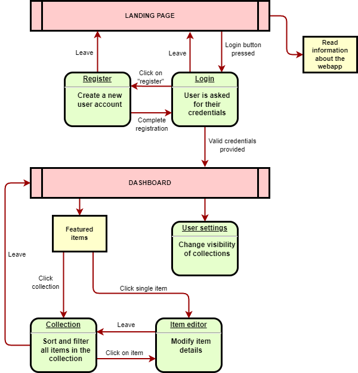

Editable version of the flowchart in the [draw.io](https://github.com/jgraph/drawio) format available [here](information-flow.drawio).

## Wireframes

Landing page (desktop)

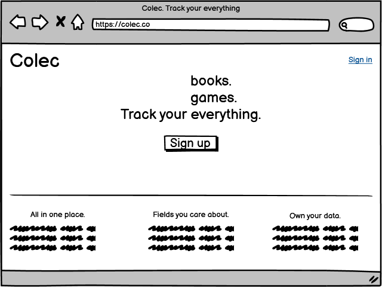

Landing page (mobile)

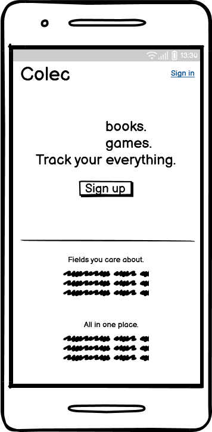

User dashboard (desktop)

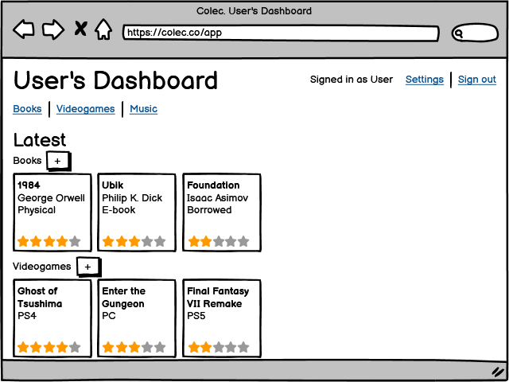

User dashboard (mobile)

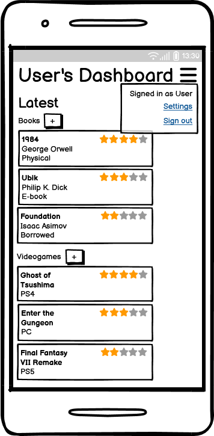

Item list (desktop)

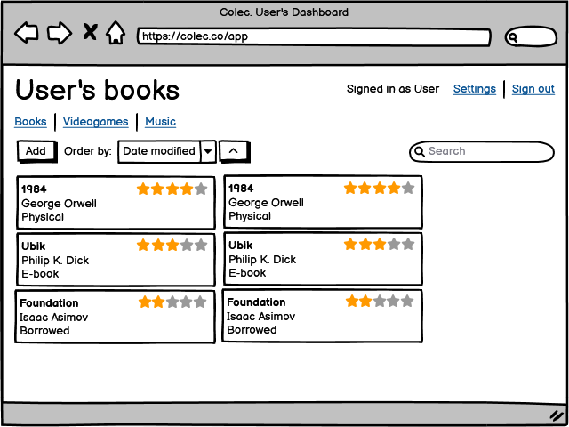

Item list (mobile)

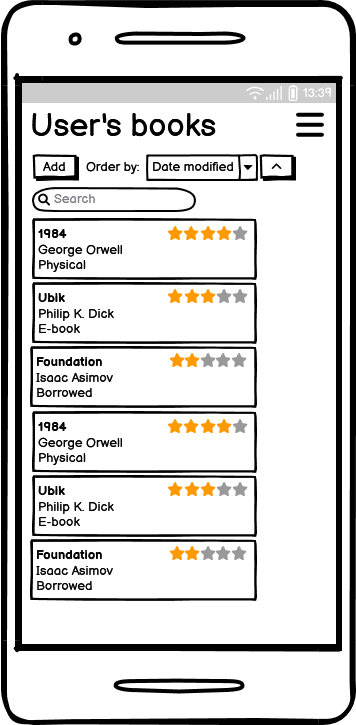

Sign-in modal

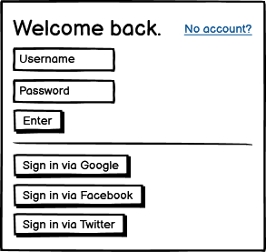

Sign-up modal

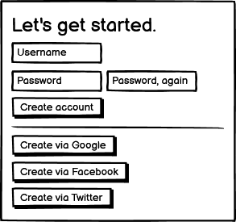

Item editor modal

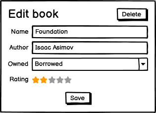

The wireframe set in [Balsamiq](https://balsamiq.com/wireframes/) format is available [here](wireframes/wireframes.bmpr).

## Database design

To realize the above mockup, these models will be required:

-   User
-   Item
-   BookDetails
-   VideogameDetails
-   MovieDetails
-   Tag

The projected table layouts and their relationships are sketched below:

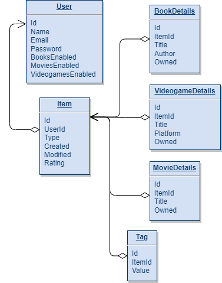

Editable version of the diagram in the [draw.io](https://github.com/jgraph/drawio) format available [here](database.drawio).

## Visual design

As the project is a utility rather than a product, it is intentionally straightforward to look at, with neutral colors and layouts that don't detract from the content. There are no transitions, and all interactive elements are buttons or highlighted links.

The fonts chosen are [Montserrat](https://fonts.google.com/specimen/Montserrat) for headings and [Nunito Sans](https://fonts.google.com/specimen/Nunito+Sans#styles) for type. Both of these fonts feature wider characters than average, helping to make better use of horizontal space and keeping text clear and readable.

## Scope post-mortem

The project ended up being tightly limited by the submission deadline. As the [GitHub project](https://github.com/users/Tearnote/projects/1/views/1) shows, only the minimum set of functionality was able to be implemented. The Agile principles helped prioritize what's important, and the end result is barebones but usable for its intended usecase, with further improvements well-documented and possible to make in the future.

In particular, user settings and item tags are missing from the MVP. If developed further, these features would be added first as the highest-priority additions.
