# Collec - Testing notes

## Validation

The HTML and CSS was validated via the [W3 validator](https://validator.w3.org/nu/) without errors.

All pages show high scores in Google Chrome's Lighthouse tool:

All Python sources show no PEP8 errors, as continuously validated by my IDE in use.

## Testing

### Landing page

1.  Open the landing page,
2.  Confirm the purpose of the site is obvious, and main points explained by info cards,
3.  Confirm the page is responsive on mobile.

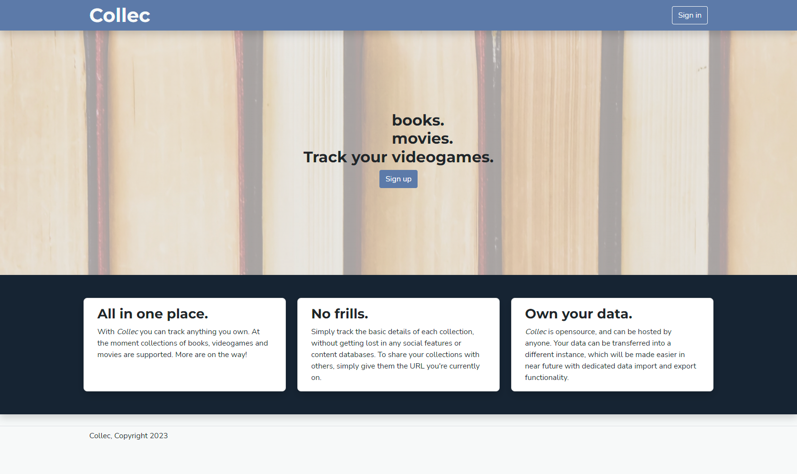

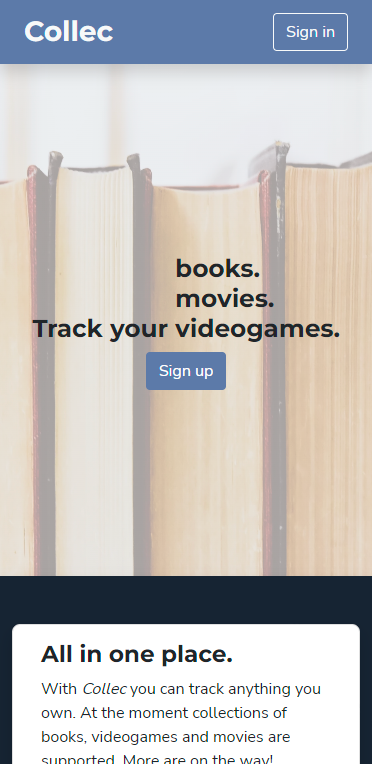

Results: test successful.

### Sign-up and sign-in

1.  Open the landing page,
2.  Press the "Sign-up button",
3.  A modal should appear. Fill in the fields with valid details of a new account and press "Sign-up",
4.  The account should be created and signed in automatically. Press "Sign out" to sign back out,
5.  Press "Sign-in" and fill in the details of the created account, then press "Sign in" to sign back in.

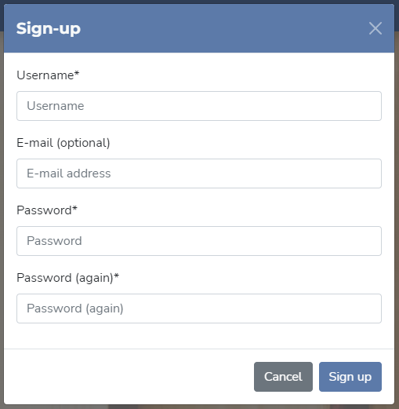

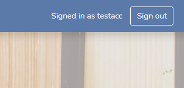

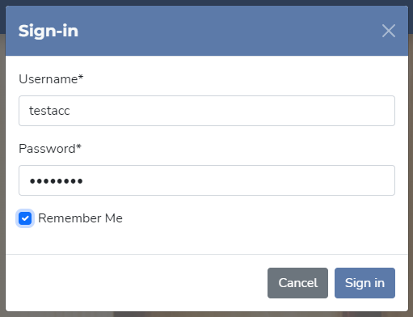

Results: test successful. Bug is present when entering details that are invalid, detailed in the [Bugs section](../README.md#bugs) of README.

### User dashboard

1.  Sign in as a user who already has a few items,
2.  Confirm that clicking "Open Dashboard" on the landing page opens the user's dashboard,
3.  Confirm that each section of the dashboard shows up to 5 of the user's items, starting from most recently modified,
4.  Confirm that pressing the "+" buttons, as well as clicking on the item names, opens the create/edit modal,
5.  Confirm that the page is responsive on mobile.

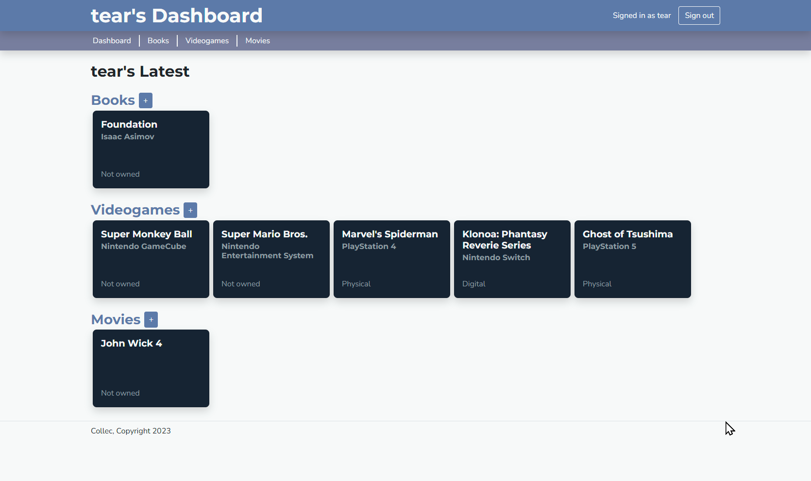

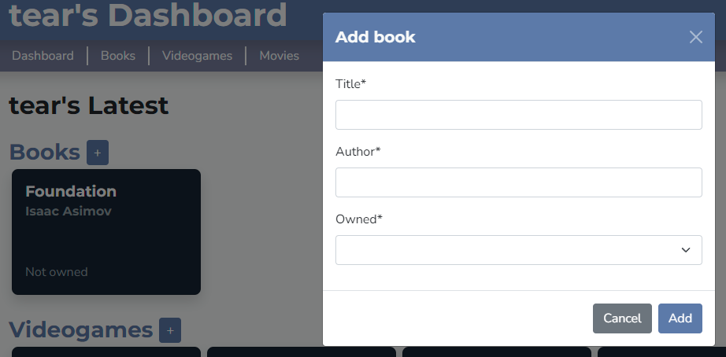

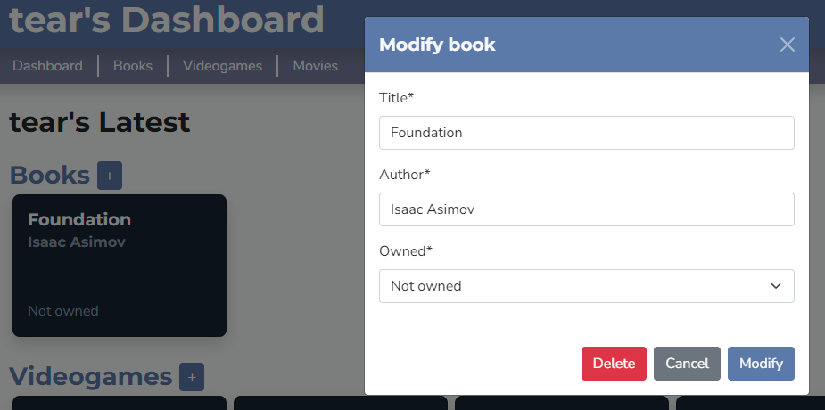

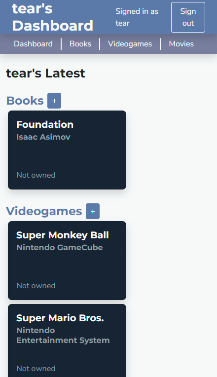

Results: test successful.

### Item list

1.  As a signed-in user with a few items, open the Books, Videogames and Movies lists and confirm that their contents reflect reality,
2.  On an item list, confirm that changing the order in the "Order by" field has the expected outcome,
3.  Put in a string in the search field, click "Search" and confirm that the expected results are returned,
4.  Click "Reset" and confirm that all results are shown again,
5.  Confirm that the page appears correct on mobile.

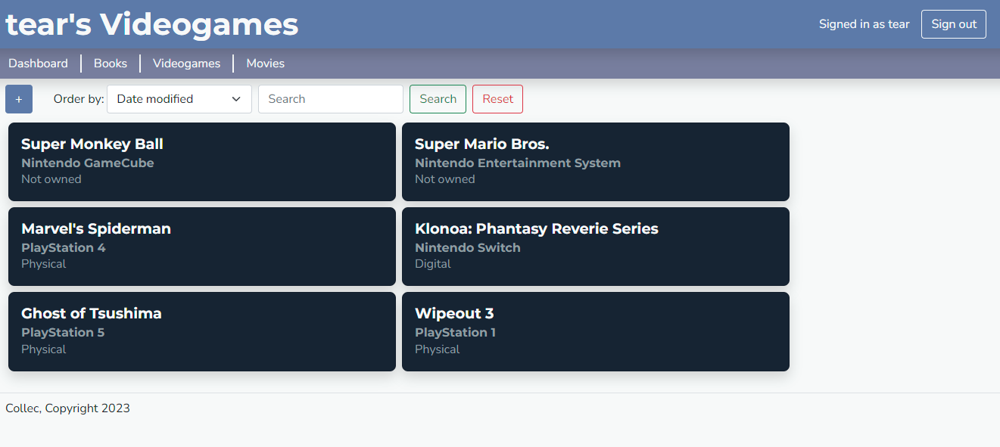

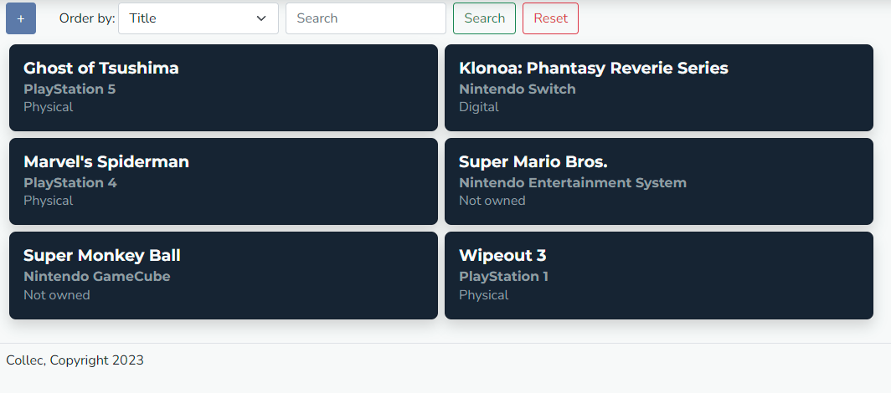

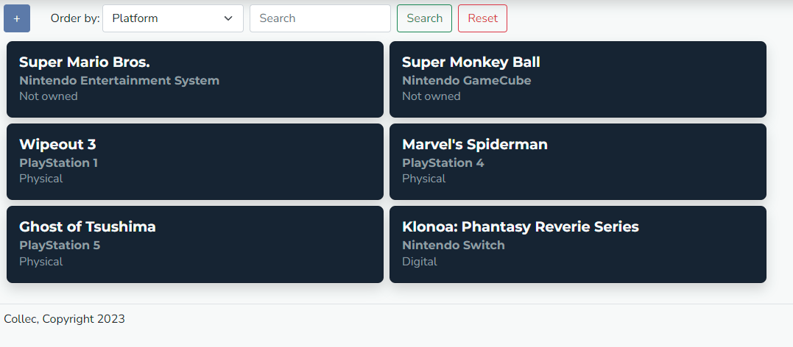

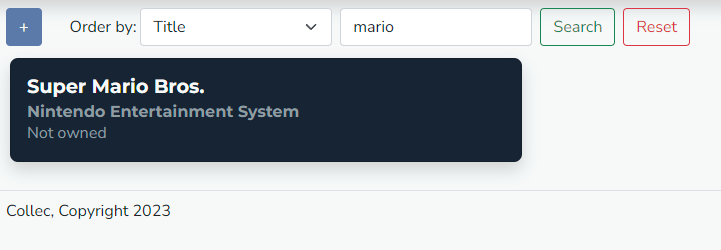

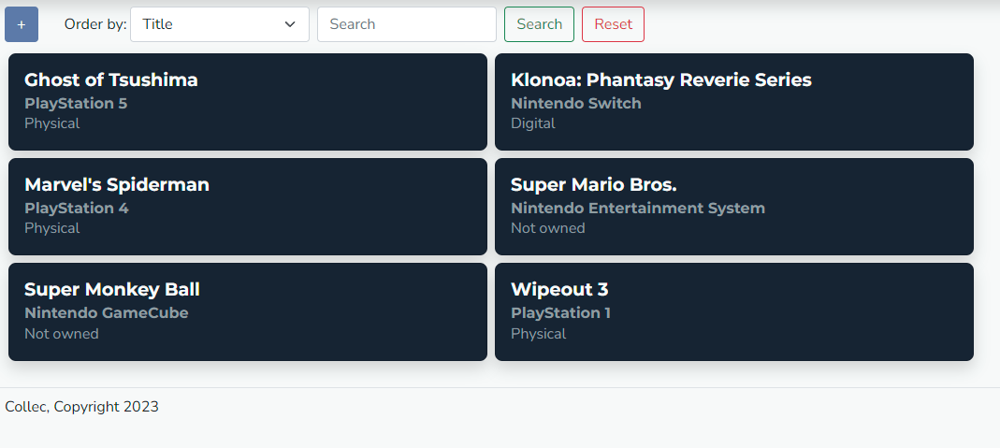

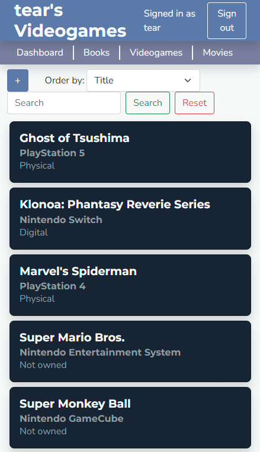

Results: test successful.

### Item editor

1.  As a signed-in user with a few items, open any item list,
2.  Click the "+" button and confirm that the new item editor modal appears,
3.  Fill in the form, click "Add", and confirm that the new item is added,
4.  Click the new item and confirm that the same modal appears with the item's details filled in,
5.  Modify the fields and click "Modify", and confirm that the changes persisted,
6.  Click the modified item, click "Delete", and confirm that the item is gone.

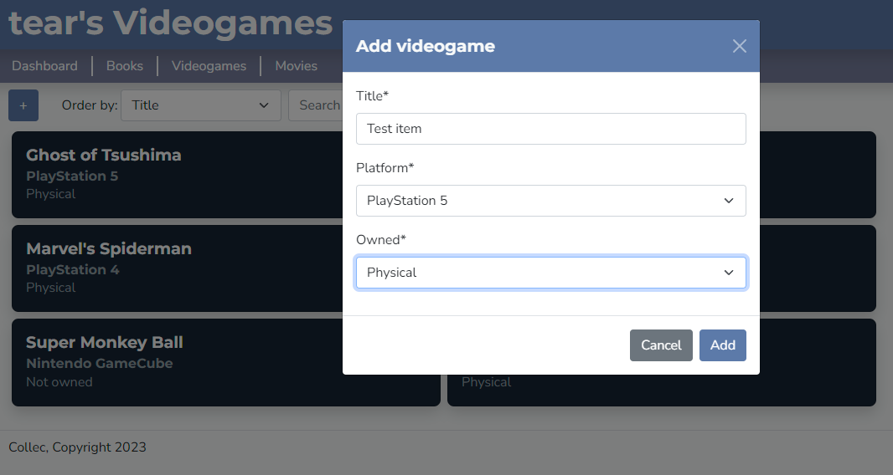

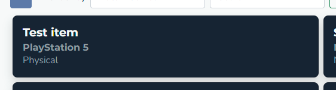

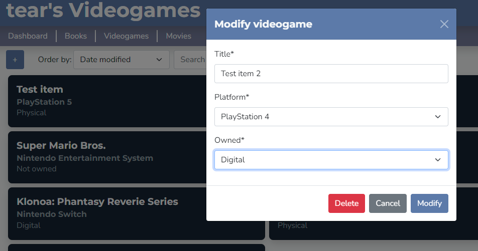

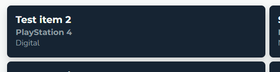

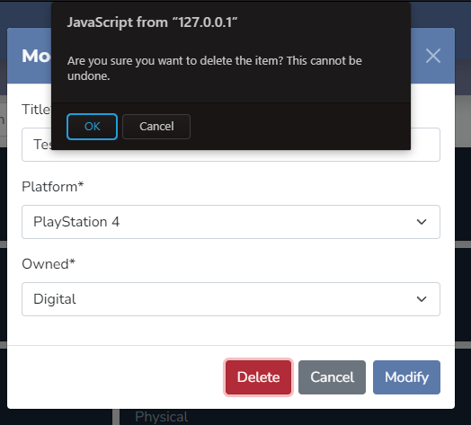

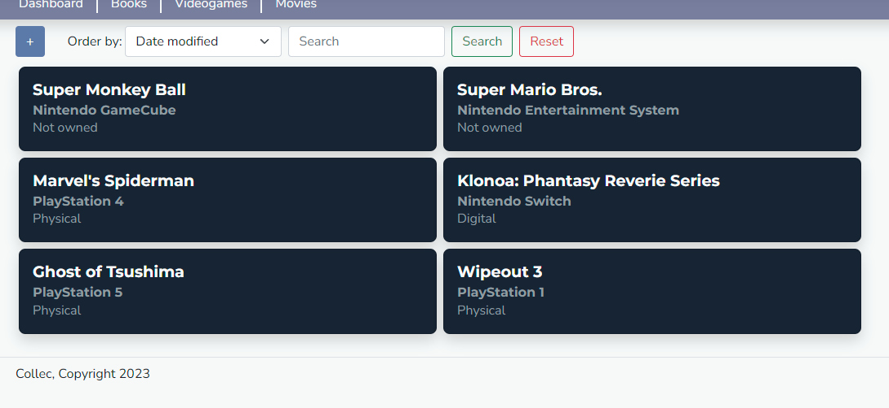

Results: test successful.

### Public view

1.  Make sure there is a user with a few items, and that you are signed out,
2.  Open the user's Dashboard using a direct link,
3.  Confirm that the dashboard can be viewed, but it is impossible to add or modify items,
4.  Confirm that item lists can be opened, filtered and sorted, but likewise any editing is disabled.

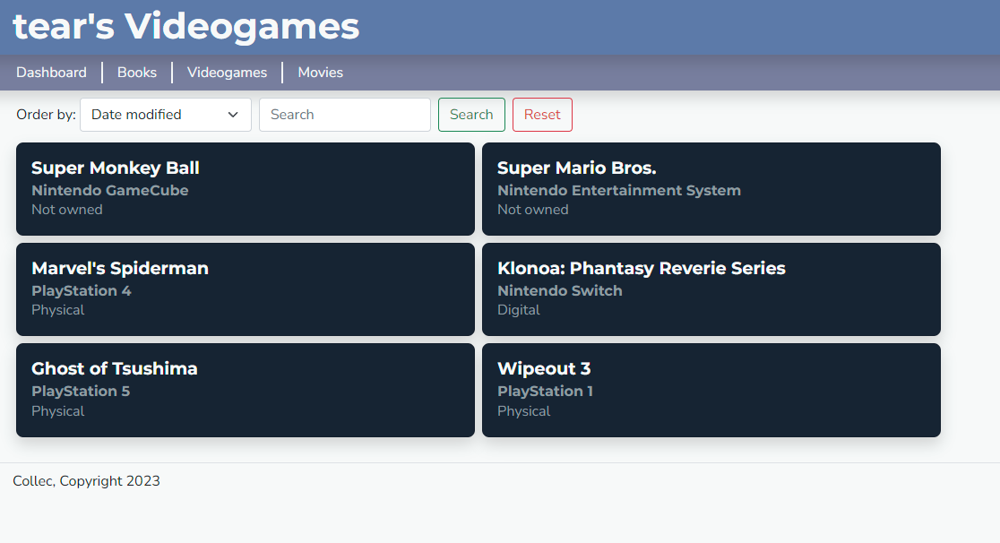

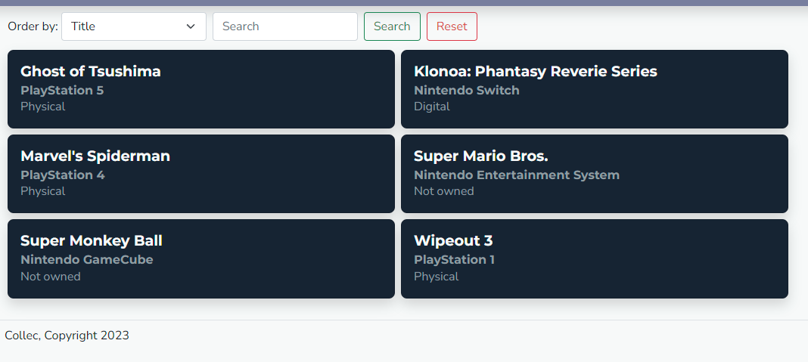

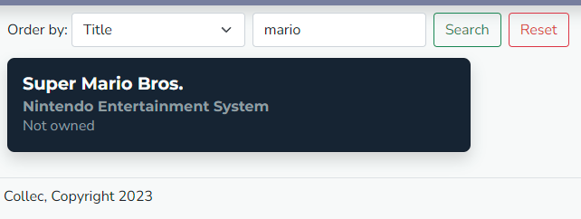

Results: test successful.
